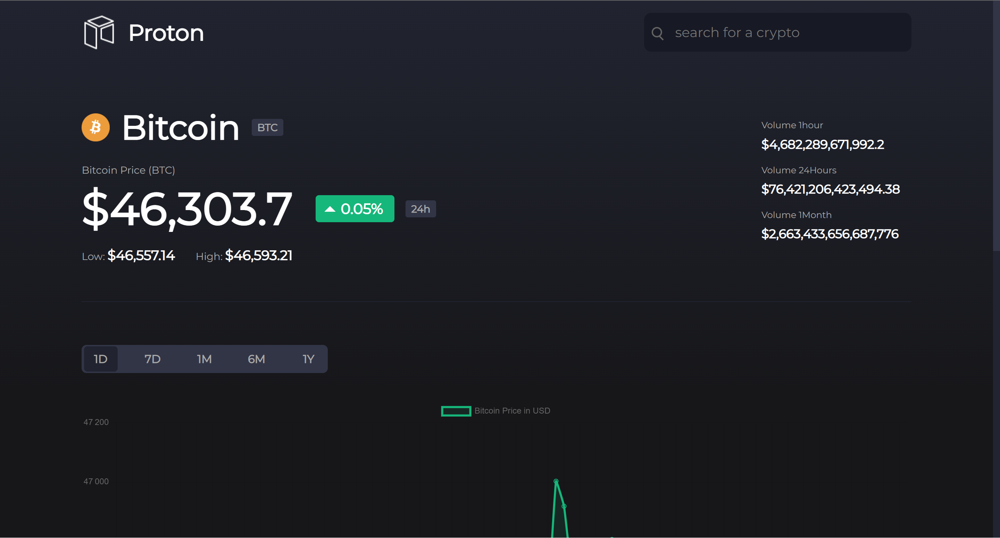
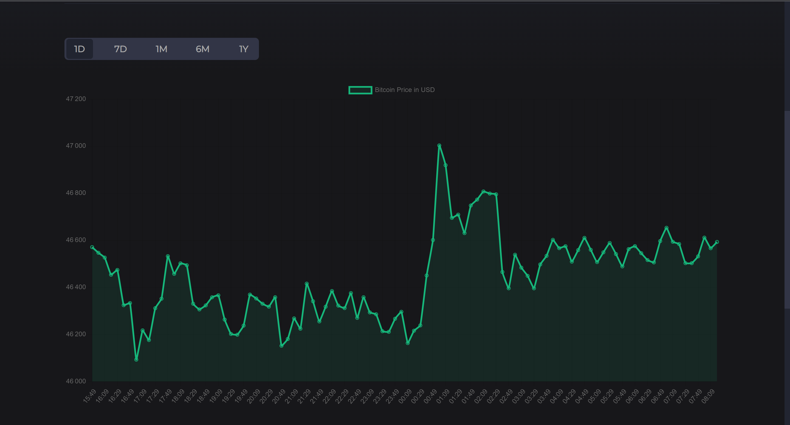
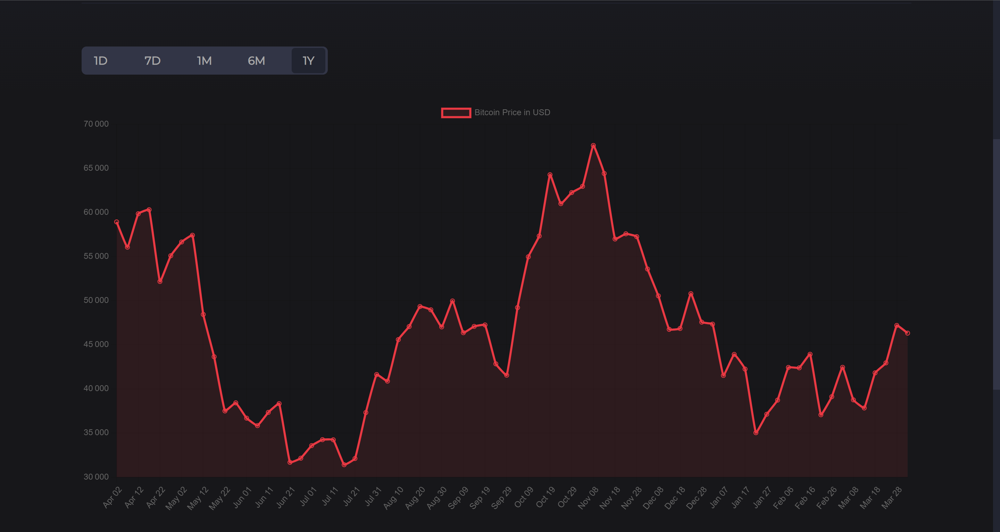

<!-- PROJECT LOGO -->
 

  
  <h3 align="center">Proton - cryptocurrencies visualizer </h3>

  

    Proton is a web app that allows you to visualize live cryptocurrency data (prices and evolution in time)
     
    <a href="https://j0suke.github.io/Proton-crypto-app/">View Demo</a>
  

<!-- TABLE OF CONTENTS -->

  
Table of Contents

  <ol>
    <li>
      <a href="#about-the-project">About The Project</a>
      <ul>
        <li><a href="#built-with">Built With</a></li>
      </ul>
    </li>
    <li><a href="#contact">Contact</a></li>
    <li><a href="#acknowledgments">Acknowledgments</a></li>
  </ol>

<!-- ABOUT THE PROJECT -->
## About The Project

this app uses an API from https://www.coinapi.io/  , it was built with vanilla JS and SCSS in 3 days 

### Built With

* [Sass](https://sass-lang.com/)
* [javascript](https://www.javascript.com/)

<!-- CONTACT -->
## Contact

* [twitter](https://twitter.com/Jean_M_____I)

* [Project Link](https://github.com/J0SUKE/Proton-crypto-app)

<!-- ACKNOWLEDGMENTS -->
## Acknowledgments

Here are the ressources i used to build the page

* [Google fonts](https://fonts.google.com/)
* [icons8](https://icons8.com/icons/)
* [chart JS](https://www.chartjs.org/)

(<a href="#top">back to top</a>)
